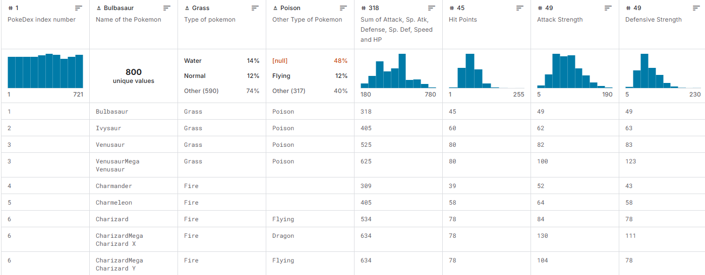
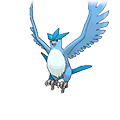
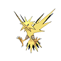
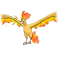

# Predicció i Classificació de Pokémon utilitzant Machine Learning

## Descripció General
Aquest projecte analitza dades de Pokémon per resoldre diversos problemes com:
- **Predicció d'estadístiques.**
- **Classificació de tipus.**
- **Agrupació per similitud.**

## Datasets
1. **[Pokemon with Stats Dataset](https://www.kaggle.com/datasets/abcsds/pokemon/data)**  
   Aquest dataset conté informació com:
   - Índex de la PokéDex.
   - Nom.
   - Tipus (Primari i secundari).
   - Estadístiques: HP, Atac, Defensa, etc.

2. **[Pokémon Image Dataset](https://www.kaggle.com/datasets/vishalsubbiah/pokemon-images-and-types)**  
   Permet analitzar dades visuals dels Pokémon per:
   - Processar colors per predir el tipus.
   - Comparar característiques visuals dins d’un grup.

## Fases del Projecte i Models
### 1. Regressió: Predicció del Total d'Estadístiques
- **Problema:** Predir una estadística (com el Total d'Estadístiques) basant-se en altres estadístiques individuals (HP, Atac, Defensa, etc.).
- **Model:** Regressió Lineal o Polinòmica.
- **Entrades i Sortides:** Estadístiques individuals com a entrada, Total d'Estadístiques com a sortida.
- **Mètriques:** RMSE, MAE.

### 2. Clustering: Agrupació per Similitud
- **Problema:** Agrupar Pokémon similars segons estadístiques i tipus.
- **Model:** K-Means.
- **Visualització:** Representació en 3D o 2D utilitzant reducció de dimensionalitat.
- **Resultat esperat:** Identificar grups com "Pokémon ràpids i dèbils" o agrupacions visuals segons tipus.

### 3. Ampliacions Opcionals
- **Probabilitats de Combat:** Estimar la probabilitat de guanyar un combat entre dos Pokémon basant-se en les seves estadístiques i tipus.
- **Sistema Recomanador:** Recomanar la millor carta per maximitzar l’atac i/o defensa contra un rival.

## Recursos
- [Dataset de Pokémon](https://www.kaggle.com/datasets/abcsds/pokemon/data)
- [Dataset d’Imatges](https://www.kaggle.com/datasets/vishalsubbiah/pokemon-images-and-types)

## Exemple de dades
Taula d'estadístiques per Pokèmon:

Imatge de Pokèmon:

---

## Contacte
Si tens preguntes o vols contribuir, no dubtis a contactar o obrir un issue!
